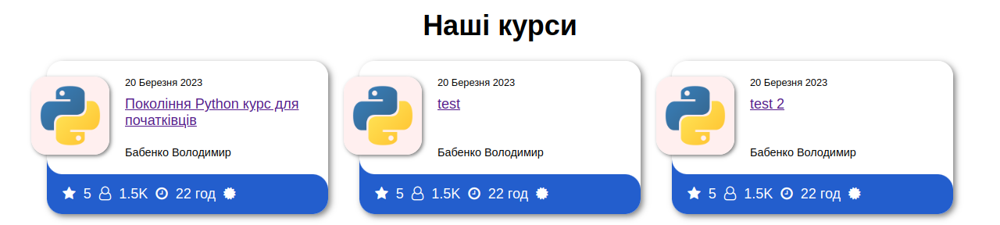
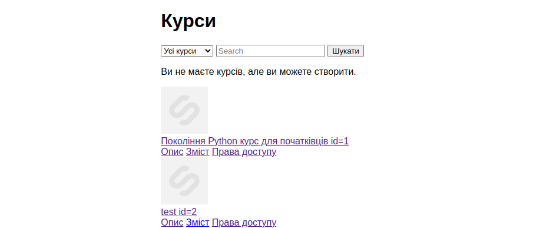
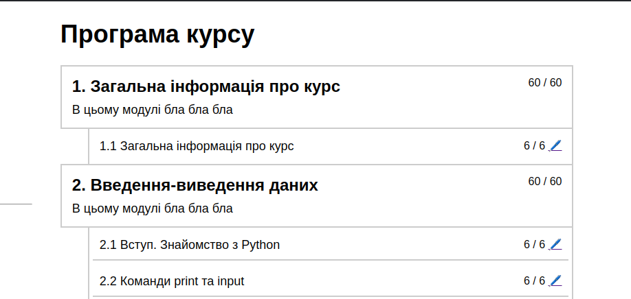
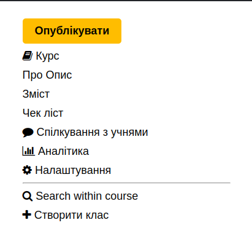

[comment]: <> (CORE)

# CORE

```text
core
    |---index.html
    |---teach_courses.html
```

`index`


`teach_courses`


[comment]: <> (COURSE)

# COURSE

```text
course
    |---syllabus.html
    |---syllabus-edit.html
```

`syllabus`


***TODO***
`syllabus-edit`

[comment]: <> (LESSON)

# LESSON

```text
lesson
    |---lesson.html
```

`lesson`


[comment]: <> (TEMPLATES)

# TEMPLATES

```text
templates
    |---course
        |---sidebar.html
    |---registration
        |---login.html
    |---base.html
    |---base_lesson.html
    |---base_main.html
    |---navbar_lesson.html
    |---navbar_main.html
```

`navbar_main`


`navbar_lesson`


`course/sidebar`



